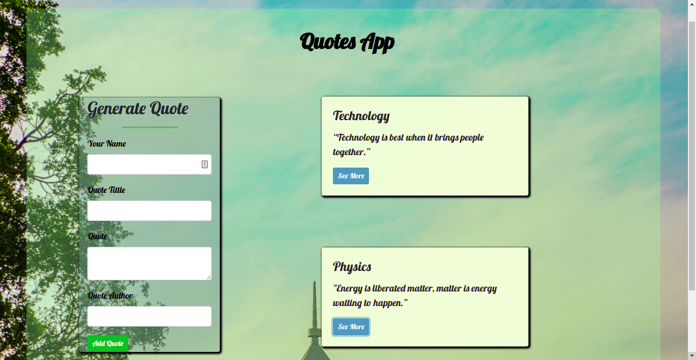

# Quotes App

### By: Flora Chepchirchir

## Description

This is an Angular project that generates quotes and gives a room for upvoting and downvoting a quote. Quotes app provides recent quotes and states the authors of the quote.

## Live Link

## BDD

The user is able to;

- View recent votes

- Share their quote

- Upvote or Downvote a quote

- Delete a quote

## Technologies

- HTML5
- CSS3
- Boostrap
- JavaScript
- Angular
- Typescript

## Licence

Copyright (c) Flora Chepchirchir- [MIT Licence](LICENSE)